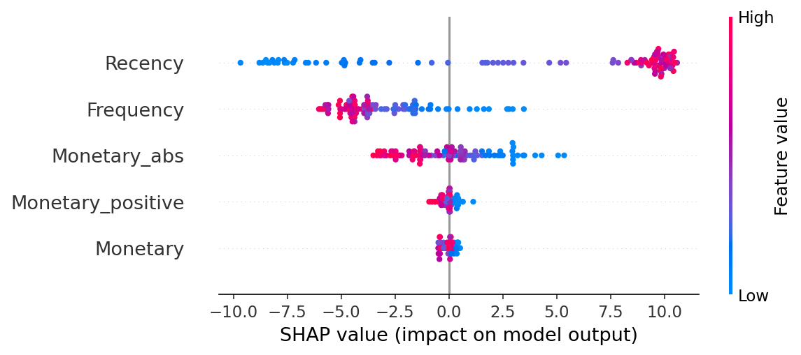
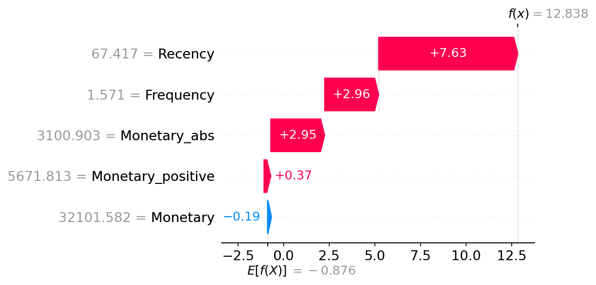

# 🏦 Credit Risk Probability Model (Alternative Data)

[](https://github.com/your-username/Credit-Risk-Probability-Model/actions)
[](https://your-app-link.streamlit.app)

An end-to-end machine learning pipeline for building, training, and deploying a credit-risk scoring service for BNPL (Buy Now Pay Later) programs, using alternative data sources.

## 🚀 Live Demo
**[Launch Interactive Dashboard](https://your-app-link.streamlit.app)**
*Test the model with custom customer data and view real-time risk assessments.*

---

## 📊 Key Results
- **ROC-AUC**: `0.999` (XGBoost champion)
- **F1 Score**: `0.983` 
- **Precision / Recall**: `0.983 / 0.995`
- **Proxy high-risk segment**: ~22% of customers
- **Estimated business impact**: Rejecting top ~20% proxy high-risk could reduce potential defaults by 30–45% (based on proxy correlation).

---

## 📸 Model Explainability (SHAP)

We use SHAP (SHapley Additive exPlanations) to ensure "Right to Explanation" and regulatory compliance (Basel II).

**Global Feature Importance (Beeswarm):**


**Individual Explanation for High-Risk Prediction (Waterfall):**


---

## 🛡️ Business Understanding & Compliance

**Basel II and Interpretability**: Capital depends on PD estimates, so regulators must retrace every assumption. We use interpretable features, monotonic transformations, and SHAP analysis so audits can reproduce results and challenge drivers.

**Proxy Target Strategy**: With no direct default label, a proxy is required to train any supervised model. If the proxy poorly represents true default behavior, predictions can misprice risk. Ongoing back-testing and proxy refinement are mandatory.

**Model Choice Trade-offs**: Logistic Regression with WoE is transparent and stable but may sacrifice lift. Gradient Boosting (XGBoost) improves AUC by modeling nonlinearity, yet raises validation burden. We provide an XGBoost champion with full SHAP transparency.

---

## 🛠️ Technical Stack
- **Languages**: Python 3.10+
- **ML Frameworks**: XGBoost, Scikit-Learn
- **Explainability**: SHAP (TreeExplainer)
- **Tracking**: MLflow (Model Registry & Experiments)
- **Deployment**: FastAPI, Streamlit, Docker, Docker Compose
- **Testing**: Pytest

---

## 📂 Project Structure
```text
├── artifacts/               # Model binaries, SHAP plots, and screenshots
├── data/                    # Raw and processed datasets (git-ignored)
├── notebooks/               # EDA and Model prototyping
├── src/
│   ├── api/                 # FastAPI prediction service
│   ├── data_processing.py   # Feature engineering pipeline
│   ├── shap_analysis.py     # SHAP generation scripts
│   └── train.py             # Model training CLI
├── tests/                   # Unit & Integration tests
└── dashboard.py             # Streamlit browser interface
```

---

## ⚡ Quick Start

### 1. Clone & Install
```bash
git clone https://github.com/your-username/Credit-Risk-Probability-Model.git
cd Credit-Risk-Probability-Model
pip install -r requirements.txt
```

### 2. Run Dashboard
```bash
streamlit run dashboard.py
```

### 3. Run API (Docker)
```bash
docker-compose up --build
```

---

## 📫 Contact
**Your Name**
- **LinkedIn**: [linkedin.com/in/your-profile](https://linkedin.com/in/your-profile)
- **Email**: your.email@example.com
- **Portfolio**: [yourportfolio.com](https://yourportfolio.com)

*Open to full-time opportunities in Credit Risk, Fintech, and MLOps.*
